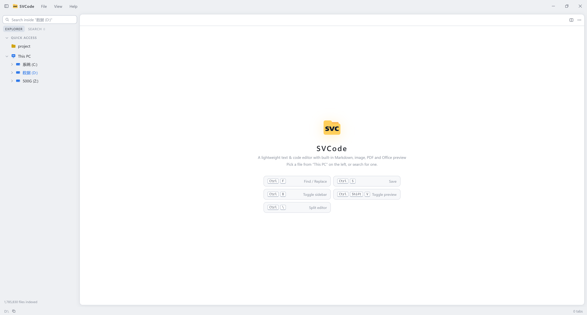
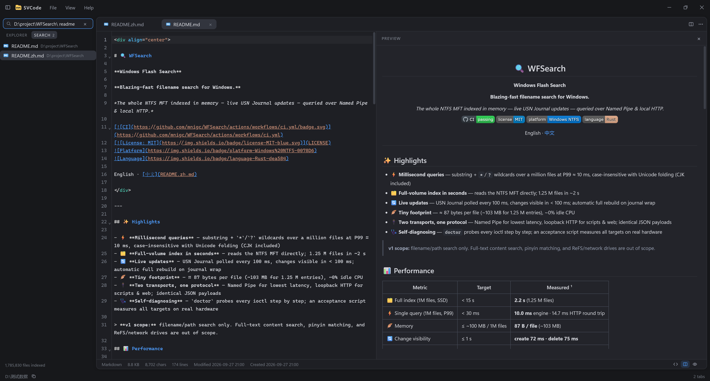

<div align="center">


# SVCode

**Simple Viewer & Code Editor**

**A lightweight, edit-first text & code editor with built-in previews — Windows first.**

[](https://github.com/mnigc/SVCode/releases/latest)
[](https://github.com/mnigc/SVCode/actions/workflows/release.yml)
[](#download)
[](https://tauri.app)

**English** | [简体中文](README.zh-CN.md)

</div>

---

## What is SVCode?

**SVCode = Simple Viewer & Code Editor.**

The positioning is **edit-first, preview-second**: at its core SVCode is a lightweight code / text
editor, with preview abilities built in so you can quickly look at Markdown, images, PDF, Office
documents and more — then edit them right away, in the same window.

Fix a config, glance at a log, tweak a script, peek at a doc — a full IDE is overkill and Notepad
is too crude. SVCode lives in that gap: **starts in seconds, shows what you open, saves as you
edit.**

- Starts in seconds; installer **≈ 4.4 MB** (whole-disk search engine included); ~100 MB RAM at idle
- No "open workspace" step: the file tree shows your **entire disk** from launch
- When you need completion, LSP or plugins, use a full IDE — SVCode only does **open fast, view
  fast, fix fast**

## Screenshots

| Light theme, whole-disk tree on launch | Markdown editing beside its live preview, with a whole-disk search run |
| --- | --- |
|  |  |

## Features

### 🗂 Whole-disk file tree + multi-tab editing
- Frameless title bar, three-pane layout with draggable splitters and collapsible panes
- Lazily-loaded directory tree with 19 built-in SVG file-type icons
- Multiple tabs, editor-group splitting (left/right/up/down), tab context menu with bulk close
- Mount **network shares** (`\\NAS\share`, SMB) as top-level tree nodes — browse, edit, preview
  and search NAS folders like local disks; mounts persist across restarts (File → Add Network
  Location)

### ⌨️ CodeMirror 6 editing core
- Syntax highlighting for C/C++, Rust, Go, Java, Python, JS/TS, HTML/CSS/Sass, Vue, PHP, SQL,
  YAML, XML, Markdown and more
- Find & replace, word wrap, font/indent settings — all persisted

### 👁 Instant previews (lazy-loaded, only when opened)
| Type | Powered by |
| --- | --- |
| Markdown | markdown-it + GFM + task lists, edit/preview split |
| HTML | sandboxed iframe preview (scripts disabled) |
| Images | PNG / JPG / GIF / WebP / SVG / BMP / ICO, zoom to fit |
| PDF | pdf.js rendering, zoom to fit |
| Office | .docx (docx-preview), .xlsx (SheetJS, truncated past 500 rows with a notice), .pptx (custom parser, text extraction) |
| Binary / unknown | "Preview not supported" card — open with the system default app or reveal in Explorer |

### 🔍 Instant whole-disk file-name search (built-in WFSearch engine)
Search is powered by the bundled [WFSearch](https://github.com/mnigc/WFSearch) engine — it indexes
NTFS directly from the MFT + USN journal: ~2 s for a million-file full index, live incremental
updates after that.

- The installer registers the bundled `wfs-server` as a Windows service (LocalSystem, started at
  boot) — that is what lets SVCode search the whole disk without ever being elevated
- The service runs from `%ProgramFiles%\WFSearch\wfs-server.exe`, a copy kept outside the app
  folder so an upgrade never fights a locked binary
- If a WFSearch service is already on the machine from a standalone install, SVCode reuses it and
  the installer leaves it untouched (and does not delete it on uninstall)
- Only when no WFSearch service is registered at all does SVCode fall back to running the sidecar
  from its own folder; that path can only index volumes when SVCode itself is run elevated
- SVCode talks to the engine over its loopback HTTP gateway and authenticates with the bearer
  token the engine publishes at `%ProgramData%\WFSearch\http.token`, so **engine 0.1.2 or newer**
  is required on both sides (0.1.2 hands registration to the deployer, tolerates a port already
  in use at boot, and validates its snapshots)
- The packaged engine version is pinned in `scripts/fetch-wfs.mjs`; upgrading is a manual edit of
  that pin followed by a rebuild, so a new engine never reaches an installer unreviewed
- Query syntax: whitespace-separated AND terms, `*`/`?` globs, terms containing `\` match the full
  path (that's what "search inside this folder" from the tree relies on)

> Reading the MFT is an administrator-only operation, which is why the engine runs as a service.
> If a volume is reported as failed, `"%ProgramFiles%\WFSearch\wfs-server.exe" doctor` probes every
> ioctl and prints where access is refused.

### 🌏 Also
- Dark / light / follow-system theme; English & Simplified Chinese UI
- **Auto-update**: a signed background check against GitHub Releases once a day, installable from
  inside the app with download progress
- Session restore: tabs, groups and layout survive restarts — **unsaved drafts too**, nothing lost
- Right-click "Open in Terminal"; files save back in their original encoding (UTF-8 / UTF-16 /
  GBK); characters the encoding can't represent refuse to save instead of corrupting the file

## Download

Grab the latest installer from [**Releases**](https://github.com/mnigc/SVCode/releases/latest) —
the whole editor ships in a download of just a few megabytes:

- `SVCode_x.y.z_x64-setup.exe` — NSIS installer, **≈ 4.4 MB** (the only package; it registers the
  search service and is also what the in-app updater installs)

Requires Windows 10 or later (renders with the bundled WebView2).

The installer installs **for all users** (UAC confirmation) and upgrades go back to the same
location automatically. There is no "current user only" mode: registering the search service
requires admin rights.

> Whole-disk search works out of the box — the installer registers the bundled WFSearch engine as
> a Windows service, so SVCode never needs to be elevated.

## Build from source

```bash
# Prerequisites: Rust stable (MSVC) + Node.js 22 + pnpm 9
pnpm install
pnpm fetch:wfs     # download the pinned WFSearch sidecar into src-tauri/binaries (not committed)
pnpm tauri dev     # development
pnpm tauri build   # package (NSIS)
```

Pushing a `v*` tag (or triggering manually from the Actions page) builds the Windows installers
automatically: tags publish to GitHub Releases, manual runs are downloadable as workflow
artifacts.

## Architecture & security model

```
SVCode (Tauri 2 window, WebView2)
├── Frontend  Vite + React 19 + TypeScript + zustand
│   ├── File tree / multi-tab editor (CodeMirror 6) / read-only preview pane
│   └── Binary resources via IPC byte streams → blob URLs (no asset protocol)
└── Backend  Rust, kept thin
    ├── fs.rs       list_dir / read_text / write_text / copy / move / ...
    ├── search.rs   thin search commands → the WFSearch engine
    ├── wfs.rs      WFSearch loopback HTTP gateway client + wfs-server sidecar lifecycle
    └── terminal.rs Open in Terminal
```

The file tree shows the whole machine's file system; reads and writes go through custom
`#[tauri::command]`s (not bound by capability scopes), so **the entire disk is reachable**. As
compensation the backend enforces two hard lines: text over ~5 MB opens read-only, over ~20 MB is
refused with a nudge to an external app; saves go through a temp file + atomic rename. Markdown
preview sanitizes raw HTML through an allowlist (dangerous tags dropped with their subtree, URL
attributes filtered), and HTML files render inside a fully sandboxed iframe — no script, form, or
popup can escape.

## Tech stack

Tauri 2 · React 19 · TypeScript · zustand · CodeMirror 6 · markdown-it · pdf.js · docx-preview ·
SheetJS · Rust (`notify` · `encoding_rs` · WFSearch sidecar)
